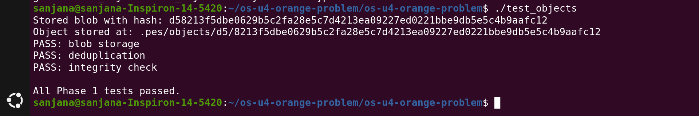
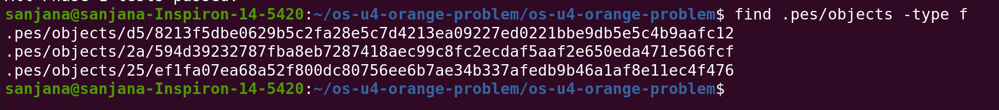
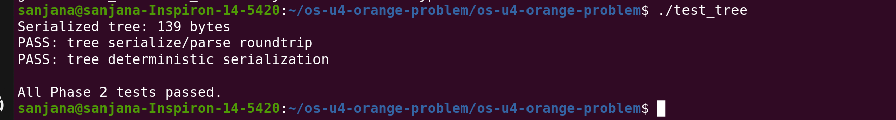
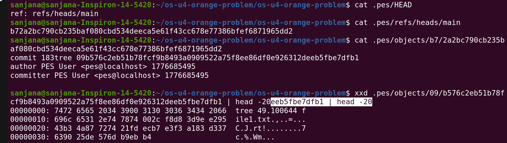
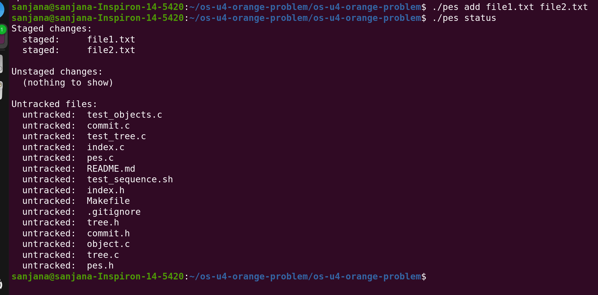
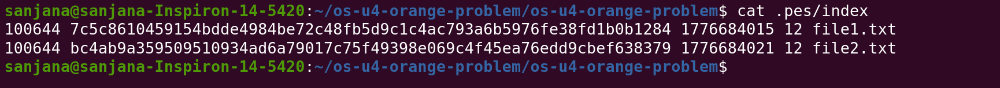
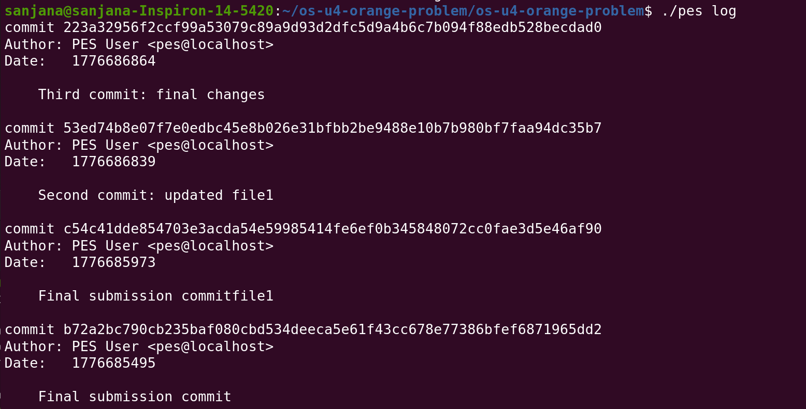
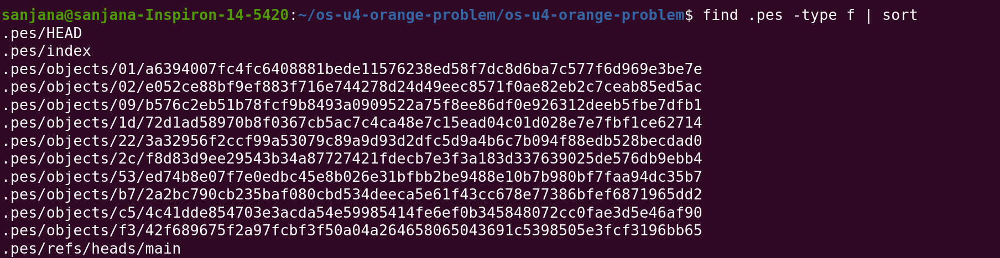
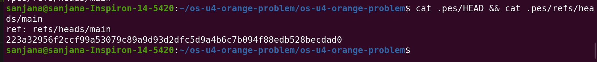
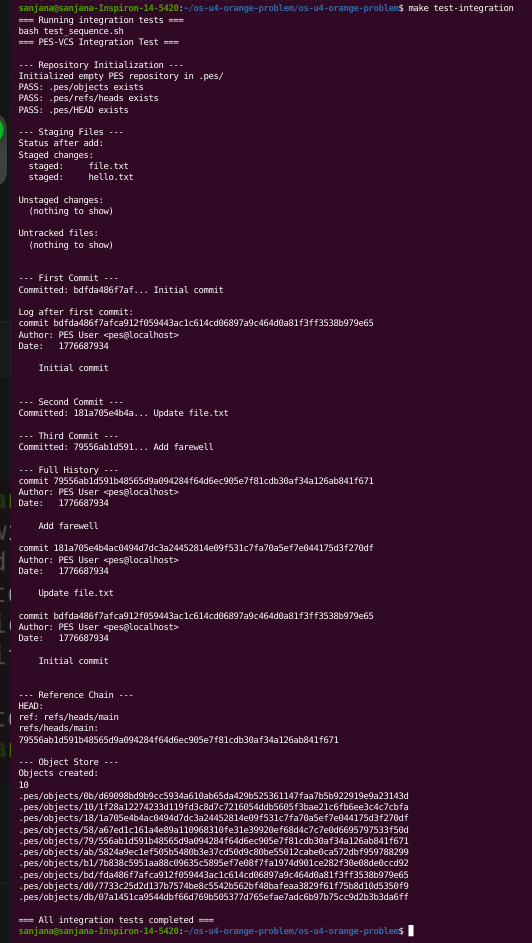

# PES-VCS Lab Report

## Student and Repository Details

- **Name:** SANJANA MEDARAMETLA
- **SRN:** PES1UG24CS908
- **Repository:** https://github.com/SanjanaM-28/PES1UG24CS908-pes-vcs
- **Platform Used:** Ubuntu 25.10 (compatible with Ubuntu 22.04 requirement)

---

## Implemented Source Files

The following files were completed as part of the lab:

- `object.c`
- `tree.c`
- `index.c`
- `commit.c`

---

# Screenshot Evidence

## Phase 1 — Object Storage

### 1A - Output of `./test_objects`

### 1B - Object Store Sharding Layout

---

## Phase 2 — Tree Objects

### 2A - Output of `./test_tree`

### 2B - Raw Tree Object using `xxd`

---

## Phase 3 — Index / Staging Area

### 3A - Repository Initialization, Add, Status

### 3B - Contents of `.pes/index`

---

## Phase 4 — Commits and History

### 4A - Commit Log with Multiple Commits

### 4B - `.pes` Internal File Growth

### 4C - HEAD and Branch Reference Chain

---

## Final Integration Test

### Output of `make test-integration`

---

# Analysis Questions

## Q5.1 - How `checkout` Could Be Implemented
To implement `pes checkout <branch>`, the following metadata files would need updates:
- `.pes/HEAD` should point to the selected branch.
- `.pes/index` should be refreshed to match the checked-out snapshot.
- The working directory must be synchronized with the target tree (creating/removing files to match the snapshot).

## Q5.2 - Detecting Dirty Working Directory Conflicts
Before a checkout, the system compares the current working file with the version stored in the index. If the `mtime` or `size` differs, the file is "dirty." If that same file needs to be changed by the checkout, the system should block the action to prevent data loss.

## Q5.3 - Detached HEAD State
A detached HEAD occurs when `.pes/HEAD` contains a raw commit hash instead of a branch reference. Commits made here are valid but aren't "tracked" by a branch name, making them harder to find later unless a new branch is created at that spot.

## Q6.1 - Garbage Collection Strategy
A mark-and-sweep strategy can be used:
1. Start at all branch references (heads).
2. Recursively "mark" every commit, tree, and blob reachable from those heads.
3. Delete any object in `.pes/objects` that was not marked.

## Q6.2 - Why Concurrent GC Is Risky
If a GC runs while a user is in the middle of a commit, the GC might see a "new" object that isn't yet linked to a branch and delete it. This would leave the new commit pointing to a missing object, corrupting the repository.

---

# Conclusion
This lab demonstrated the core internals of a Version Control System, focusing on content-addressable storage and the relationship between commits, trees, and blobs.
